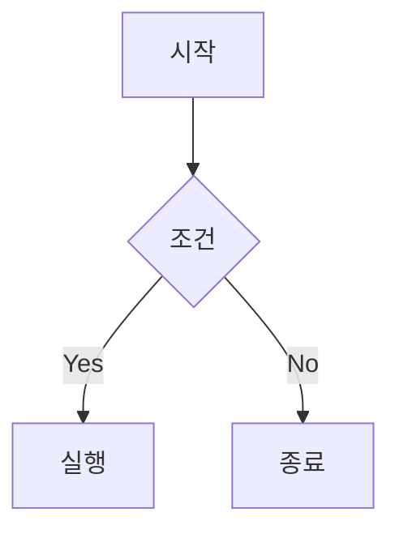

# MDX 작성 가이드

Tech Docs Portal은 **MDX** (Markdown + JSX) 형식으로 문서를 작성합니다.
이 가이드에서는 자주 사용하는 MDX 문법과 컴포넌트를 소개합니다.

## Frontmatter

모든 MDX 파일의 상단에는 YAML frontmatter가 필요합니다.

```yaml
---
title: 페이지 제목
description: 페이지 설명 (선택)
---
```

| 필드 | 필수 | 설명 |
|------|------|------|
| `title` | O | 페이지 제목 (사이드바, 브라우저 탭에 표시) |
| `description` | X | 페이지 설명 (검색 결과, 메타태그에 사용) |
| `icon` | X | 사이드바 아이콘 |
| `full` | X | `true`이면 전체 너비 레이아웃 |

## 제목 (Headings)

```md
# H1 제목 (페이지당 1개 권장)
## H2 제목 (주요 섹션)
### H3 제목 (하위 섹션)
#### H4 제목
```

> H2, H3는 우측 "On this page" TOC에 자동으로 표시됩니다.

## 텍스트 스타일

```md
**굵게**, *기울임*, ~~취소선~~, `인라인 코드`
```

**굵게**, *기울임*, ~~취소선~~, `인라인 코드`

## 링크

```md
[내부 링크](/docs/2025/project-alpha)
[외부 링크](https://github.com)
```

## 코드블록

언어를 지정하면 syntax highlighting이 적용됩니다.

````md
```typescript
interface Project {
  name: string;
  year: number;
  tags: string[];
}

function getProject(id: string): Project {
  return { name: 'Alpha', year: 2025, tags: ['Terraform'] };
}
```
````

실제 렌더링:

```typescript
interface Project {
  name: string;
  year: number;
  tags: string[];
}

function getProject(id: string): Project {
  return { name: 'Alpha', year: 2025, tags: ['Terraform'] };
}
```

### 지원 언어

| 언어 | 식별자 |
|------|--------|
| TypeScript | `typescript` 또는 `ts` |
| JavaScript | `javascript` 또는 `js` |
| Python | `python` 또는 `py` |
| Bash/Shell | `bash` 또는 `sh` |
| YAML | `yaml` 또는 `yml` |
| JSON | `json` |
| SQL | `sql` |
| CSS | `css` |
| HTML | `html` |
| Dockerfile | `dockerfile` |

## 테이블

```md
| 헤더 1 | 헤더 2 | 헤더 3 |
|--------|--------|--------|
| 셀 1   | 셀 2   | 셀 3   |
| 셀 4   | 셀 5   | 셀 6   |
```

| 헤더 1 | 헤더 2 | 헤더 3 |
|--------|--------|--------|
| 셀 1   | 셀 2   | 셀 3   |
| 셀 4   | 셀 5   | 셀 6   |

## 목록

```md
- 비순서 목록 항목 1
- 비순서 목록 항목 2
  - 중첩 항목

1. 순서 목록 항목 1
2. 순서 목록 항목 2
```

- 비순서 목록 항목 1
- 비순서 목록 항목 2
  - 중첩 항목

1. 순서 목록 항목 1
2. 순서 목록 항목 2

## 인용

```md
> 이것은 인용 블록입니다.
> 여러 줄로 작성할 수 있습니다.
```

> 이것은 인용 블록입니다.
> 여러 줄로 작성할 수 있습니다.

## Mermaid 다이어그램

코드블록 언어를 `mermaid`로 지정하면 자동으로 다이어그램으로 렌더링됩니다.

````md

````


## 체크리스트

```md
- [x] 완료된 항목
- [ ] 미완료 항목
- [ ] 다른 미완료 항목
```

- [x] 완료된 항목
- [ ] 미완료 항목
- [ ] 다른 미완료 항목
