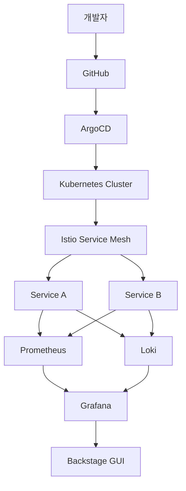

v1 아키텍처에 서비스 메시와 GitOps 레이어를 추가한 구조입니다.

## 시스템 구성도

## v1 대비 변경 사항

| 레이어 | v1 | v2 추가 |
|--------|-----|---------|
| 배포 | GitHub Actions 직접 배포 | ArgoCD GitOps 선언적 배포 |
| 네트워크 | K8s 기본 네트워크 | Istio mTLS + 트래픽 관리 |
| 로깅 | 없음 | Loki 중앙 집중 로깅 |
| GUI | 없음 | Backstage 개발자 포탈 |
