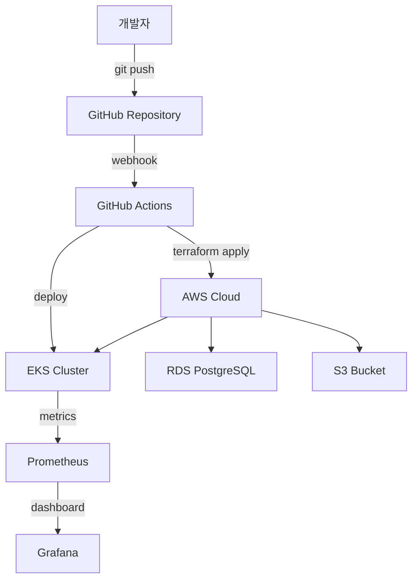
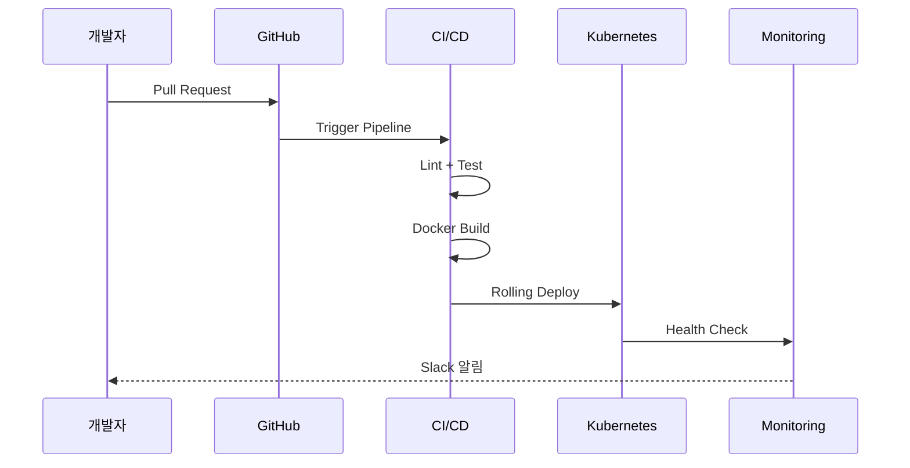

## 전체 구성도

## 배포 흐름

## 네트워크 구성

| 서브넷 | CIDR | 용도 |
|--------|------|------|
| Public | 10.0.1.0/24 | ALB, NAT Gateway |
| Private-App | 10.0.2.0/24 | EKS 워커 노드 |
| Private-DB | 10.0.3.0/24 | RDS 인스턴스 |

## 보안 정책

- 모든 통신 TLS 1.3 암호화
- IAM Role 기반 최소 권한 원칙 적용
- 시크릿은 AWS Secrets Manager 관리
