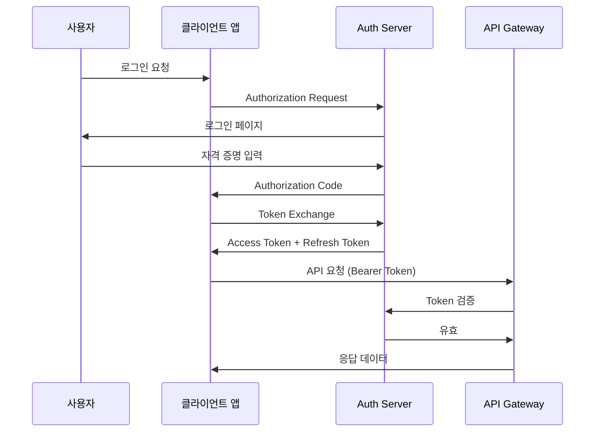

## 목표

기존 분산된 인증 체계를 OAuth 2.0 + OIDC 기반 통합 인증으로 전환합니다.

## 인증 흐름

```mermaid
sequenceDiagram
    participant User as 사용자
    participant App as 클라이언트 앱
    participant Auth as Auth Server
    participant API as API Gateway
    User->>App: 로그인 요청
    App->>Auth: Authorization Request
    Auth->>User: 로그인 페이지
    User->>Auth: 자격 증명 입력
    Auth->>App: Authorization Code
    App->>Auth: Token Exchange
    Auth->>App: Access Token + Refresh Token
    App->>API: API 요청 (Bearer Token)
    API->>Auth: Token 검증
    Auth->>API: 유효
    API->>App: 응답 데이터
```

## 지원 Provider

- Google Workspace (SSO)
- GitHub (개발자 인증)
- LDAP (사내 AD 연동)
