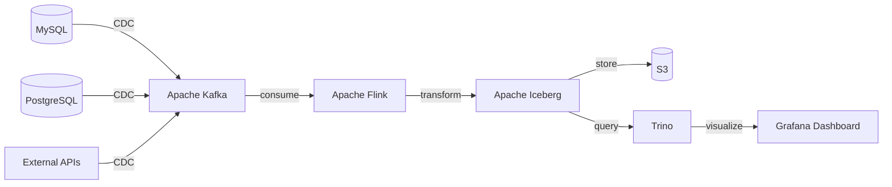
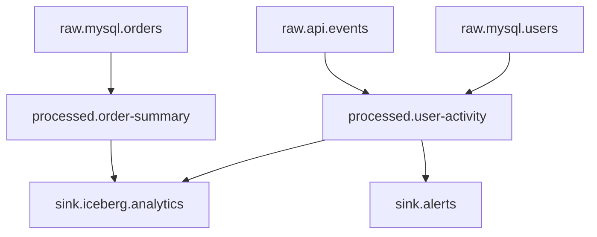

## 전체 데이터 흐름

## Kafka 토픽 설계

## 장애 복구 전략

| 장애 유형 | 탐지 | 복구 방법 | RTO |
|-----------|------|-----------|-----|
| Kafka 브로커 장애 | ISR 감소 알림 | 자동 리밸런싱 | 2min 이내 |
| Flink Job 실패 | Checkpoint 실패 | 마지막 Checkpoint 복구 | 5min 이내 |
| S3 접근 불가 | Write 실패 알림 | Kafka 버퍼링 후 재시도 | 10min 이내 |
